<div align="center">

# 📊 SortLab — Sorting Algorithm Analyzer

### A JavaFX 21 desktop app that benchmarks and animates six classic sorting algorithms — plus a Python dashboard for the results

*Compare runtime, comparisons and interchanges across thousands of runs, run tasks in parallel, then watch the algorithms race side-by-side as animated bar charts with sound.*


</div>

---

## 📑 Table of Contents

1. [Overview](#-overview)
2. [Feature Tour](#-feature-tour)
3. [Screenshots](#-screenshots)
4. [System Architecture](#-system-architecture)
5. [Tech Stack](#-tech-stack)
6. [Repository & File Structure](#-repository--file-structure)
7. [The Algorithms (Implementation Deep Dive)](#-the-algorithms-implementation-deep-dive)
8. [Backend Logic Deep Dive](#-backend-logic-deep-dive)
9. [UI Deep Dive](#-ui-deep-dive)
10. [Data Model, Input & CSV Format](#-data-model-input--csv-format)
11. [Key Flows (Sequence Diagrams)](#-key-flows-sequence-diagrams)
12. [Concurrency Design](#-concurrency-design)
13. [Python Analysis Script](#-python-analysis-script)
14. [Sample Results & What They Show](#-sample-results--what-they-show)
15. [Design Patterns](#-design-patterns)
16. [OOP Principles & SOLID](#-oop-principles--solid)
17. [Data Structures & Algorithms Used](#-data-structures--algorithms-used)
18. [Getting Started](#-getting-started)
19. [Configuration](#-configuration)
20. [Testing](#-testing)
21. [Known Limitations & Roadmap](#-known-limitations--roadmap)

---

## 🔭 Overview

**SortLab** answers two questions about sorting algorithms:

1. **"How fast is it, really?"** — *Comparison Mode* runs any combination of **Bubble, Insertion, Selection, Merge, Quick and Heap Sort** against the same kind of input (random / sorted / inversely sorted / loaded from a file), many times over, and reports **min / avg / max runtime in nanoseconds**, plus the number of **comparisons** and **interchanges**. Tasks can run **sequentially or in parallel** on a thread pool, and results export to **CSV**.
2. **"What is it actually doing?"** — *Visualization Mode* records every step of each algorithm and replays them as **animated bar charts** — several algorithms **side by side on the same input** — with adjustable speed, single-step mode, live counters and **audio feedback** (pitch follows the value being touched).

A small **Python script** turns the exported CSV into a 4-panel dark-theme dashboard, and a **LaTeX report** documents the design and findings.

| | |
|---|---|
| **Language** | Java 21 (app) · Python 3 (analysis) · LaTeX (report) |
| **UI** | JavaFX 21 — FXML layouts, CSS "Carbon dark" theme, `Canvas` rendering |
| **Size** | 30 Java/FXML/CSS source files · ~2,200 lines of Java + 551 lines of CSS · 95-line Python script |
| **Entry point** | `sorting.Main` (`mvn javafx:run`) |
| **Persistence** | None — results live in memory and export to CSV on demand |

---

## ✨ Feature Tour

| Area | What you can do |
|---|---|
| 🧪 **Benchmarking** | Pick any of 6 algorithms, array size, array type (`RANDOM`, `SORTED`, `INVERSELY_SORTED`) and number of runs; get min/avg/max runtime, avg comparisons, avg interchanges |
| 📂 **File input** | Load one or **many** `.txt` files (`[5, 1, 2, 6]`); one task is created per file per algorithm |
| ⚡ **Parallel mode** | One click runs all queued tasks on a fixed thread pool sized `min(tasks, CPU cores)` |
| 🗂️ **Pending-task queue** | Table of tasks still waiting/running; rows disappear as results arrive |
| 📈 **Results table + summary bar** | 9-column results grid, AVG / MIN / MAX badges, row-count badge |
| ⬇️ **CSV export** | Save the table via a file chooser for Excel or the Python dashboard |
| 🎬 **Animated visualizer** | One bar-chart panel per algorithm, same base array for a fair race (max **100** elements) |
| ⏯️ **Playback controls** | Play, Pause, Step (one frame), Reset; speed slider **0.5× – 4×** |
| 🔢 **Counters** | Comparisons / interchanges / progress label under every chart; array values are also drawn as boxes below the bars |
| 🔊 **Sonification** | A 50 ms sine tone per frame, frequency `150 + (value/max) × 1050` Hz |
| 🎨 **Color language** | Idle = slate, active = red, finished = teal |
| 🐍 **Python dashboard** | 4 charts: avg runtime (log), min/avg/max (log), comparisons vs interchanges, runtime-vs-size scaling (log) |

---

## 🖼️ Screenshots

> Images live in `SortingAlgorithms/latex/Images/` (they are also used by the LaTeX report). Paths below assume this README sits at the repository root.

**Comparison Mode** — 6 algorithms × 2 sizes, results table, pending-task queue and the AVG/MIN/MAX bar

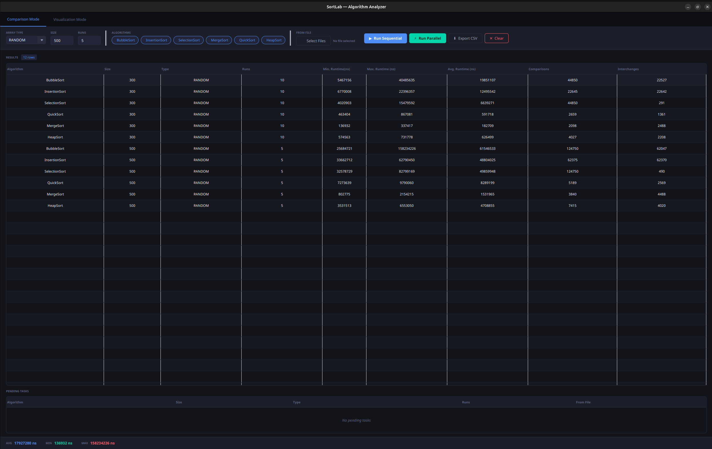

**Visualization Mode** — four algorithms racing on the same 15-element array

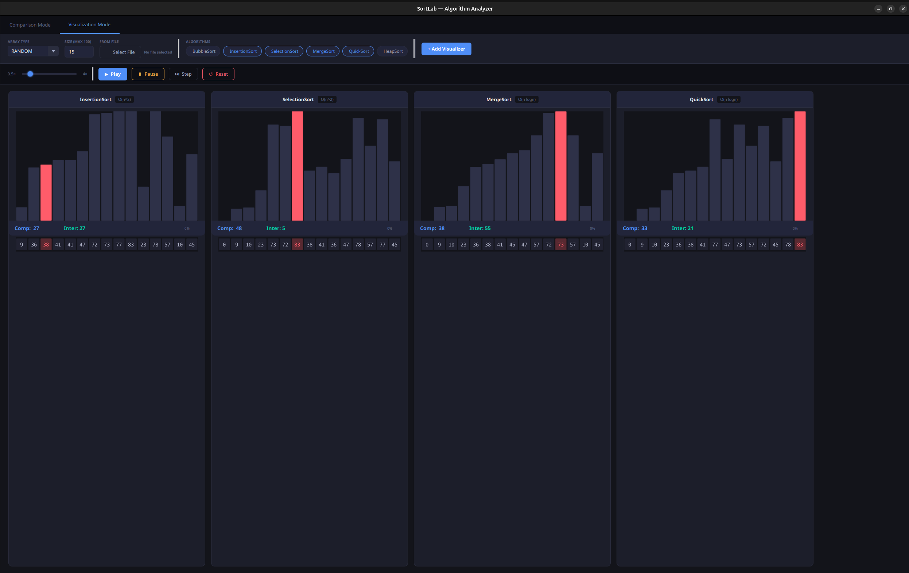

**BubbleSort vs MergeSort mid-run** (Merge is already teal/finished while Bubble is still swapping)

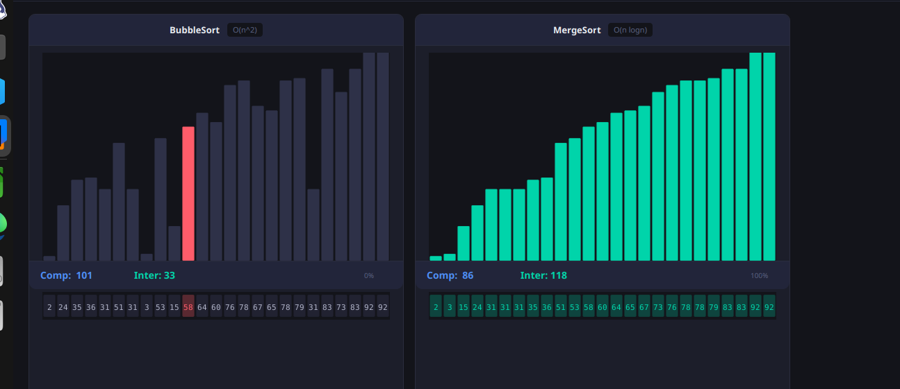

**Python dashboard outputs**

| Average runtime (log) | Scaling with array size (log) |
|---|---|
| 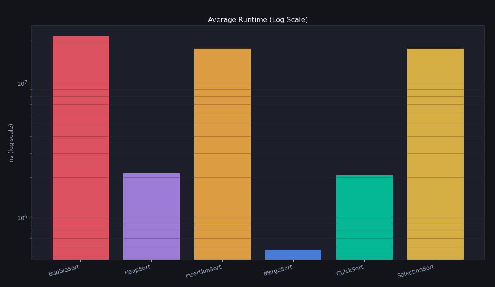 | 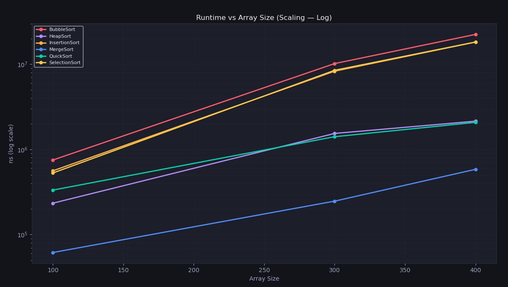 |
| **Min / Avg / Max runtime (log)** | **Comparisons vs interchanges** |
| 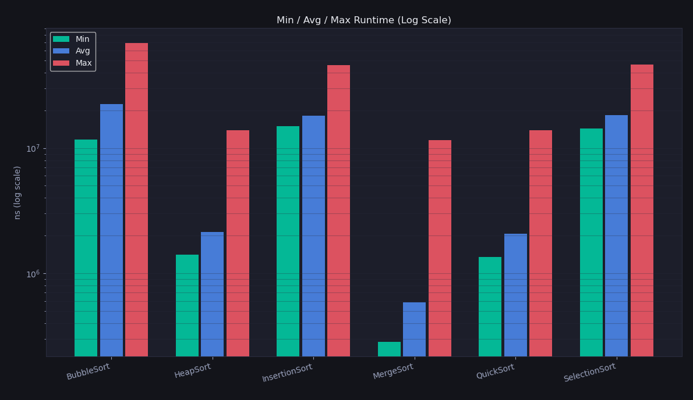 | 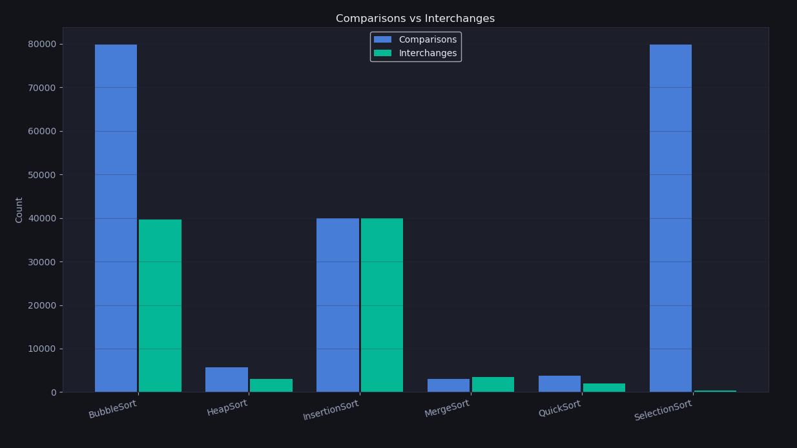 |

---

## 🏗️ System Architecture

### High-level view

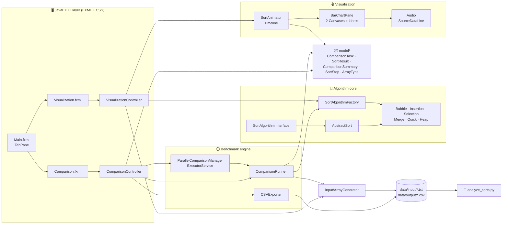
```mermaid
flowchart LR
    subgraph UI["🖥️ JavaFX UI layer (FXML + CSS)"]
        direction TB
        MAINF["Main.fxml<br/>TabPane"]
        CMPF["Comparison.fxml"]
        VIZF["Visualization.fxml"]
        CC["ComparisonController"]
        VC["VisualizationController"]
        MAINF --> CMPF --> CC
        MAINF --> VIZF --> VC
    end

    subgraph BENCH["⏱️ Benchmark engine"]
        direction TB
        CR["ComparisonRunner"]
        PCM["ParallelComparisonManager<br/>ExecutorService"]
        CSV["CSVExporter"]
        PCM --> CR
    end

    subgraph ALGO["🧮 Algorithm core"]
        direction TB
        FAC["SortAlgorithmFactory"]
        IFACE["SortAlgorithm interface"]
        ABS["AbstractSort"]
        IMPL["Bubble · Insertion · Selection<br/>Merge · Quick · Heap"]
        FAC --> IMPL
        IFACE --> ABS --> IMPL
    end

    subgraph VIZ["🎬 Visualization"]
        direction TB
        BCP["BarChartPane<br/>2 Canvases + labels"]
        SA["SortAnimator<br/>Timeline"]
        AUD["Audio<br/>SourceDataLine"]
        SA --> BCP --> AUD
    end

    MODEL["📦 model/<br/>ComparisonTask · SortResult · ComparisonSummary · SortStep · ArrayType"]
    GEN["input/ArrayGenerator"]
    PY["🐍 analyze_sorts.py"]
    FILES[("data/input/*.txt<br/>data/output/*.csv")]

    CC --> CR
    CC --> PCM
    CC --> CSV
    VC --> FAC
    VC --> SA
    CR --> FAC
    CR --> GEN
    VC --> GEN
    CR --> MODEL
    CC --> MODEL
    SA --> MODEL
    GEN --> FILES
    CSV --> FILES
    FILES --> PY
```

### Layering

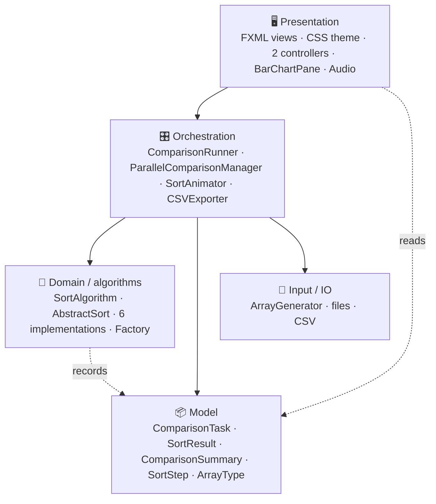
```mermaid
flowchart TB
    A["🖥️ Presentation<br/>FXML views · CSS theme · 2 controllers · BarChartPane · Audio"]
    B["🎛️ Orchestration<br/>ComparisonRunner · ParallelComparisonManager · SortAnimator · CSVExporter"]
    C["🧮 Domain / algorithms<br/>SortAlgorithm · AbstractSort · 6 implementations · Factory"]
    D["📦 Model<br/>ComparisonTask · SortResult · ComparisonSummary · SortStep · ArrayType"]
    E["🔧 Input / IO<br/>ArrayGenerator · files · CSV"]
    A --> B --> C
    B --> D
    B --> E
    A -.reads.-> D
    C -.records.-> D
```

### Two modes, one algorithm core

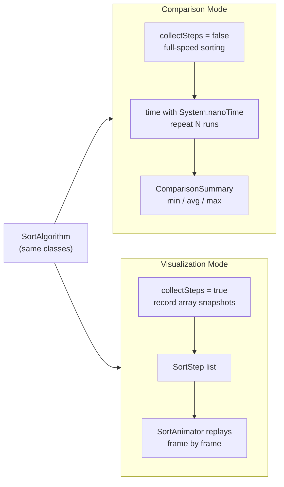
```mermaid
flowchart LR
    ALG["SortAlgorithm<br/>(same classes)"]
    subgraph M1["Comparison Mode"]
        S1["collectSteps = false<br/>full-speed sorting"]
        S2["time with System.nanoTime<br/>repeat N runs"]
        S3["ComparisonSummary<br/>min / avg / max"]
        S1 --> S2 --> S3
    end
    subgraph M2["Visualization Mode"]
        V1["collectSteps = true<br/>record array snapshots"]
        V2["SortStep list"]
        V3["SortAnimator replays<br/>frame by frame"]
        V1 --> V2 --> V3
    end
    ALG --> M1
    ALG --> M2
```

The `collectSteps` flag in `AbstractSort` lets **the very same algorithm code** serve both benchmarking (no snapshot overhead) and animation (a snapshot after each interesting operation).

---

## 🧰 Tech Stack

| Technology | Version | Purpose |
|---|---|---|
| **Java** | 21 | Language/runtime — switch expressions, `List.getFirst()` / `getLast()` (Java 21 sequenced collections), `Random.nextInt(origin, bound)` |
| **JavaFX** (`javafx-controls`, `javafx-fxml`) | 21 | Desktop GUI: `TabPane`, `TableView`, `Canvas`, `Timeline`, `Task` |
| **FXML** | — | Declarative layouts (`Main`, `Comparison`, `Visualization`) with `fx:include` and `fx:controller` |
| **JavaFX CSS** | — | "Carbon dark" theme, ~90 style rules in `style.css` |
| **Maven** | 3.8+ | Build; `javafx-maven-plugin` 0.0.8 provides `mvn javafx:run` (main class `sorting.Main`) |
| **`javafx.concurrent.Task` + `ExecutorService`** | JDK | Background benchmark threads, thread pool for parallel mode |
| **`javax.sound.sampled`** | JDK | Real-time sine-tone synthesis (`SourceDataLine`, 44.1 kHz, 16-bit mono) |
| **Python 3** | 3.9+ | Post-run analysis |
| **pandas · matplotlib · numpy** | — | CSV loading, grouping, 4-panel dark-theme dashboard |
| **LaTeX** (`report.tex`) | — | 973-line project report (TikZ, pgfplots, listings, tcolorbox) |
| **IntelliJ IDEA** | — | Project metadata in `.idea/` |

> There are **no third-party Java libraries** beyond JavaFX — threading, sound, file I/O and formatting are all plain JDK.

---

## 📂 Repository & File Structure

```text
Sorting-Algorithms-master/
├── README.md
├── .idea/                                      IntelliJ project metadata
│
└── SortingAlgorithms/                          ☕ Maven project root
    ├── pom.xml                                 Java 21 · JavaFX 21 · javafx-maven-plugin
    ├── analyze_sorts.py                        🐍 4-panel analysis dashboard
    ├── data/
    │   ├── input/input.txt                     Sample array: [1, 4, 5, 2, 8, 9, 10, 12, 7, 0, 35]
    │   └── output/results.csv                  Sample export (6 algorithms × sizes 100 / 300 / 400)
    ├── latex/
    │   ├── report.tex                          Full project report (973 lines)
    │   └── Images/                             11 screenshots and charts used by the report
    └── src/main/
        ├── java/sorting/
        │   ├── Main.java                       JavaFX Application entry point
        │   ├── algorithms/                     🧮 Algorithm core
        │   │   ├── SortAlgorithm.java          interface (7 methods)
        │   │   ├── AbstractSort.java           shared counters, steps, swap(), addStep()
        │   │   ├── BubbleSort.java
        │   │   ├── InsertionSort.java
        │   │   ├── SelectionSort.java
        │   │   ├── MergeSort.java
        │   │   ├── QuickSort.java              randomized pivot
        │   │   ├── HeapSort.java               max-heap
        │   │   └── SortAlgorithmFactory.java   name → instance
        │   ├── comparison/                     ⏱️ Benchmark engine
        │   │   ├── ComparisonRunner.java       runs one task N times, times each run
        │   │   ├── ParallelComparisonManager.java   thread-pool orchestrator
        │   │   └── CSVExporter.java
        │   ├── input/ArrayGenerator.java       random / sorted / inverse / from file
        │   ├── model/
        │   │   ├── ArrayType.java              enum SORTED | INVERSELY_SORTED | RANDOM
        │   │   ├── ComparisonTask.java         immutable job description
        │   │   ├── SortResult.java             one run's measurements
        │   │   ├── ComparisonSummary.java      aggregate over runs (+ getSummary())
        │   │   └── SortStep.java               one animation frame
        │   ├── ui/
        │   │   ├── ComparisonController.java   332 lines
        │   │   └── VisualizationController.java   201 lines
        │   └── visualization/
        │       ├── BarChartPane.java           two Canvases + stat labels
        │       ├── SortAnimator.java           Timeline-driven step player
        │       └── Audio.java                  tone synthesis
        └── resources/
            ├── css/style.css                   Carbon dark theme
            └── fxml/  Main.fxml · Comparison.fxml · Visualization.fxml
```

> The zip also contains a few non-source leftovers (`SortingAlgorithms/venv/pyvenv.cfg`, `texput.log`, nested `.idea/` folders) — see [Limitations](#-known-limitations--roadmap).

---

## 🧮 The Algorithms (Implementation Deep Dive)

### Class hierarchy

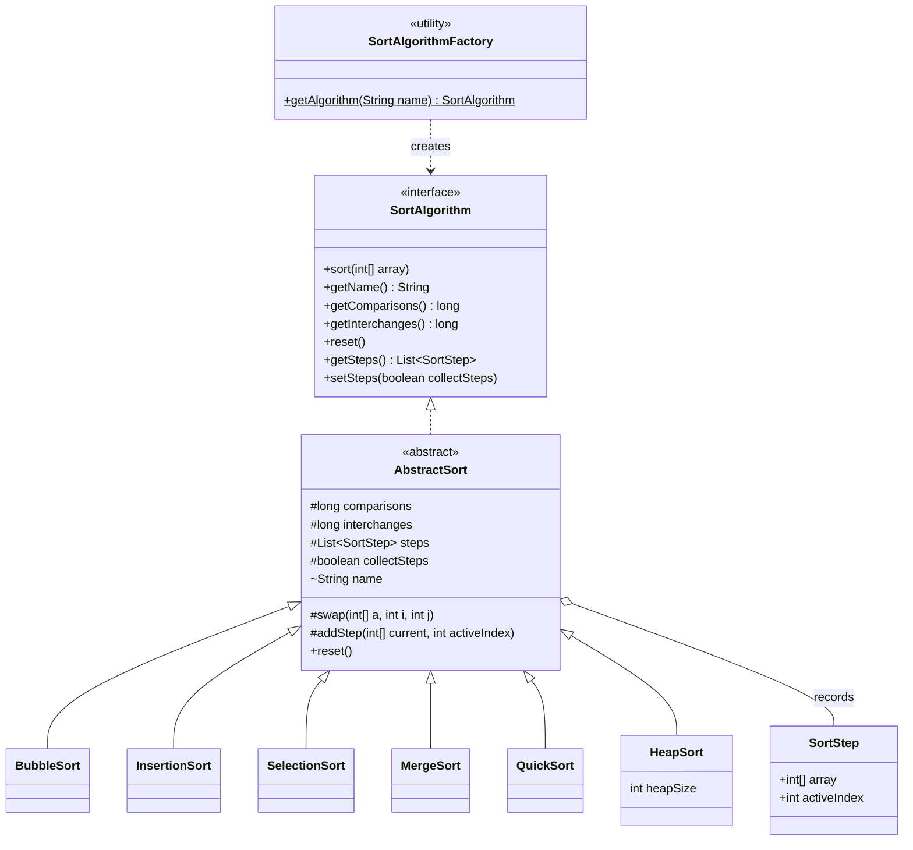
```mermaid
classDiagram
    direction TB
    class SortAlgorithm {
        <<interface>>
        +sort(int[] array)
        +getName() String
        +getComparisons() long
        +getInterchanges() long
        +reset()
        +getSteps() List~SortStep~
        +setSteps(boolean collectSteps)
    }
    class AbstractSort {
        <<abstract>>
        #long comparisons
        #long interchanges
        #List~SortStep~ steps
        #boolean collectSteps
        ~String name
        #swap(int[] a, int i, int j)
        #addStep(int[] current, int activeIndex)
        +reset()
    }
    class BubbleSort
    class InsertionSort
    class SelectionSort
    class MergeSort
    class QuickSort
    class HeapSort {
        int heapSize
    }
    class SortAlgorithmFactory {
        <<utility>>
        +getAlgorithm(String name)$ SortAlgorithm
    }
    class SortStep {
        +int[] array
        +int activeIndex
    }
    SortAlgorithm <|.. AbstractSort
    AbstractSort <|-- BubbleSort
    AbstractSort <|-- InsertionSort
    AbstractSort <|-- SelectionSort
    AbstractSort <|-- MergeSort
    AbstractSort <|-- QuickSort
    AbstractSort <|-- HeapSort
    SortAlgorithmFactory ..> SortAlgorithm : creates
    AbstractSort o-- SortStep : records
```

**`AbstractSort`** owns everything the six algorithms share:

| Member | Role |
|---|---|
| `comparisons`, `interchanges` | Counters each algorithm increments where it considers appropriate |
| `steps` + `collectSteps` | Animation recording, **off by default** so benchmarks pay nothing |
| `swap(a, i, j)` | Three-line swap helper |
| `addStep(array, activeIndex)` | Appends a `SortStep` (a *clone* of the array + the highlighted index) **only if** `collectSteps` is true |
| `reset()` | Clears counters and steps so one instance is reusable between runs |

### Per-algorithm details

| Algorithm | How this implementation works | Time (best / avg / worst) | Extra space | Stable? |
|---|---|---|---|---|
| **Bubble** | Nested loops; inner range shrinks by `i`. **No early-exit flag**, so it always performs exactly `n(n−1)/2` comparisons | O(n²) / O(n²) / O(n²) | O(1) | ✅ |
| **Insertion** | Saves `array[i]`, shifts larger elements right inside a `while` loop, then drops the saved value in place. Each shift *and* the final placement count as interchanges | **O(n)** / O(n²) / O(n²) | O(1) | ✅ |
| **Selection** | Finds the minimum of the unsorted tail, swaps it to the front. At most `n−1` swaps | O(n²) in all cases | O(1) | ❌ |
| **Merge** | Top-down recursion; copies each half into **new arrays**, sorts them recursively, then merges back. "Interchanges" counts element *writes* during merging | O(n log n) in all cases | O(n) | Stable by design — but this code takes the *right* element on ties (`<` instead of `<=`), so it is not stable as written (irrelevant for plain ints) |
| **Quick** | **Randomized pivot**: picks a random index in `[p, r]`, swaps it to the front, then partitions with the pivot at `p` (elements `≤ pivot` move left). Recurses on both sides | O(n log n) / O(n log n) / O(n²) | O(log n) expected stack | ❌ |
| **Heap** | `build_max_heap` (bottom-up from `n/2 − 1`), then repeatedly swaps the root with the last heap element, shrinks `heapSize`, and recursively `max_heapify`s. Children of `i` are `2i+1` and `2i+2` | O(n log n) in all cases | O(1) (+ recursion) | ❌ |

### What "comparisons" and "interchanges" mean here

The counters are **algorithm-specific conventions**, so compare them with care:

| Algorithm | Comparison counted… | Interchange counted… |
|---|---|---|
| Bubble | each `array[j] > array[j+1]` test | each swap |
| Insertion | each test against `temp` in the shift loop | each shift, plus the final placement if the element moved |
| Selection | each `array[j] < array[min]` test | each swap (only when `i != min`) |
| Merge | each `left < right` test in the main merge loop | each element **written** back during a merge |
| Quick | each element tested against the pivot | the pivot-to-front swap, each partition swap, and the final pivot swap |
| Heap | each child-vs-largest test | each swap (build-heap and extraction) |

This is why, in the sample data, Insertion Sort's interchanges (40,010) are almost equal to its comparisons (40,014) while Selection Sort has only 390 interchanges at the same array size.

---

## ⚙️ Backend Logic Deep Dive

Base package: `sorting`

### Input generation — `ArrayGenerator`

| Method | Behaviour |
|---|---|
| `generateFromRandom(size, type)` | Fills an `int[]` with `random.nextInt(100)` → values **0–99**. `SORTED` → `Arrays.sort`; `INVERSELY_SORTED` → sort, then reverse in place; `RANDOM` → as generated |
| `generateFromFile(path)` | Reads **one line**, strips `[` `]`, splits on `", "`, parses ints. Returns `null` (after printing a message) if the file is missing or unreadable |

### Benchmark engine — `comparison/`

**`ComparisonTask`** (immutable): `algorithmName, arraySize, arrayType, noOfRuns, fromFile, fileName`.

**`ComparisonRunner.run()`** — the heart of Comparison Mode:

```java
SortAlgorithm algorithm = SortAlgorithmFactory.getAlgorithm(task.getAlgorithmName());
int[] original = fromFile ? generateFromFile(...) : generateFromRandom(size, type);
for (int i = 0; i < runs; i++) {
    if (type == RANDOM && !fromFile) original = generateFromRandom(size, type); // fresh data each run
    algorithm.reset();
    long start = System.nanoTime();
    algorithm.sort(original.clone());                 // never mutates the master copy
    long duration = System.nanoTime() - start;
    results.add(mapAlgorithmToResult(algorithm, duration, i, original.length));
}
```

Key points: every run sorts a **clone** (so sorted/inverse/file inputs stay intact across runs); `RANDOM` regenerates data on each run; each task owns **its own algorithm instance** (so counters never leak between tasks or threads).

**`ComparisonSummary.getSummary(List<SortResult>)`** folds the per-run results into one row: min / max / **average** runtime, **average** comparisons and interchanges (integer division), plus algorithm name, size, type and run count.

**`ParallelComparisonManager`** — collects tasks, creates a fixed pool of `min(tasks, availableProcessors)` threads, submits one `Callable` per task, then joins the `Future`s in submission order. `shutdown()` stops the pool. See [Concurrency Design](#-concurrency-design).

**`CSVExporter.export(summaries, path)`** — writes the header plus one line per summary using a `PrintWriter` in a try-with-resources block.

### Model classes

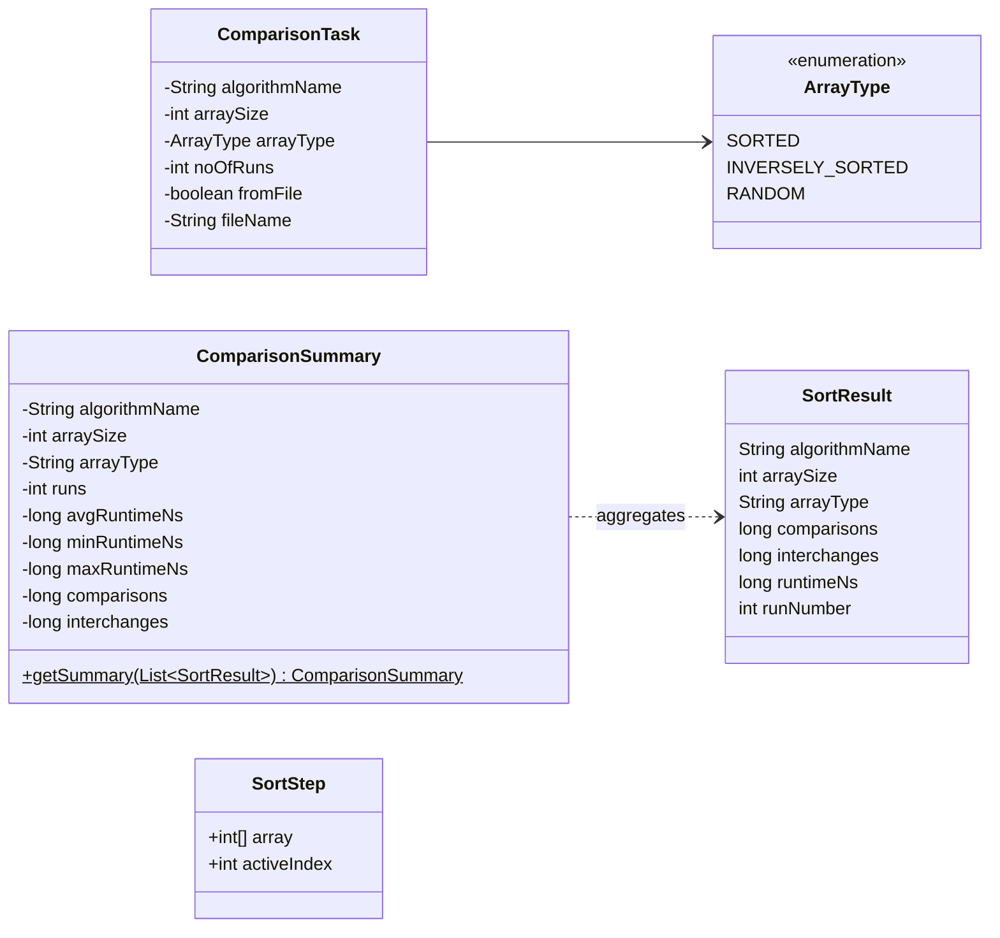
```mermaid
classDiagram
    direction LR
    class ArrayType {
        <<enumeration>>
        SORTED
        INVERSELY_SORTED
        RANDOM
    }
    class ComparisonTask {
        -String algorithmName
        -int arraySize
        -ArrayType arrayType
        -int noOfRuns
        -boolean fromFile
        -String fileName
    }
    class SortResult {
        String algorithmName
        int arraySize
        String arrayType
        long comparisons
        long interchanges
        long runtimeNs
        int runNumber
    }
    class ComparisonSummary {
        -String algorithmName
        -int arraySize
        -String arrayType
        -int runs
        -long avgRuntimeNs
        -long minRuntimeNs
        -long maxRuntimeNs
        -long comparisons
        -long interchanges
        +getSummary(List~SortResult~)$ ComparisonSummary
    }
    class SortStep {
        +int[] array
        +int activeIndex
    }
    ComparisonTask --> ArrayType
    ComparisonSummary ..> SortResult : aggregates
```

| Class | One-line role |
|---|---|
| `ComparisonTask` | "What to run": input to the runner |
| `SortResult` | "What one run produced": raw measurement |
| `ComparisonSummary` | "What the table shows": aggregate of many `SortResult`s; also the `TableView` row type |
| `SortStep` | "One animation frame": defensive copy of the array + the active index |
| `ArrayType` | Enum of input shapes |

---

## 🖥️ UI Deep Dive

### Window structure

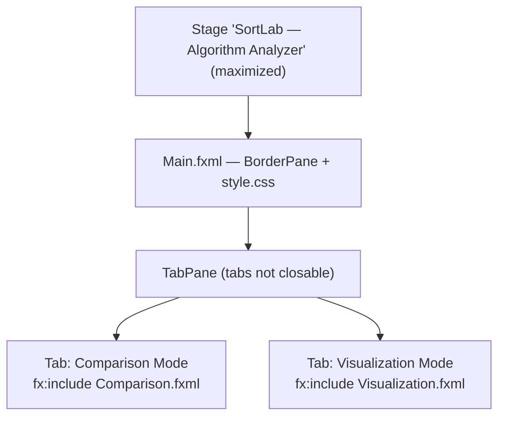
```mermaid
flowchart TB
    STAGE["Stage 'SortLab — Algorithm Analyzer' (maximized)"]
    ROOT["Main.fxml — BorderPane + style.css"]
    TABS["TabPane (tabs not closable)"]
    T1["Tab: Comparison Mode<br/>fx:include Comparison.fxml"]
    T2["Tab: Visualization Mode<br/>fx:include Visualization.fxml"]
    STAGE --> ROOT --> TABS
    TABS --> T1
    TABS --> T2
```

### Comparison tab (`Comparison.fxml` + `ComparisonController`)

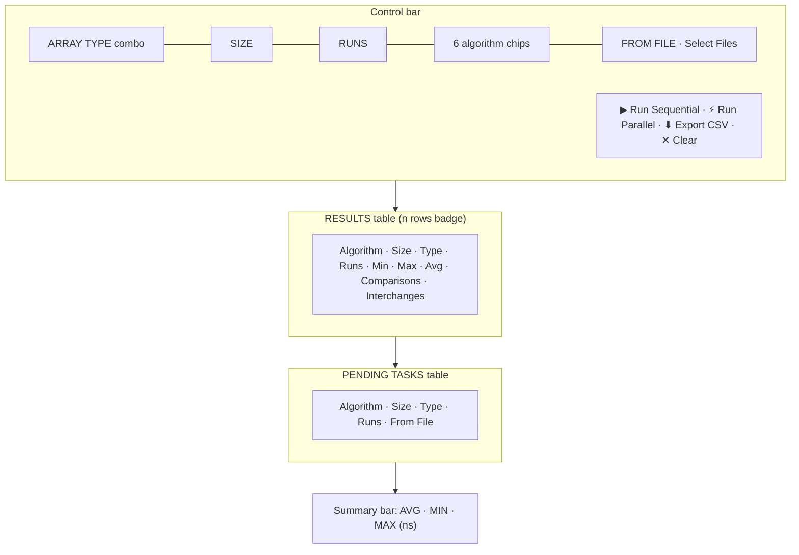
```mermaid
flowchart TB
    subgraph CB["Control bar"]
        direction LR
        A1["ARRAY TYPE combo"] --- A2["SIZE"] --- A3["RUNS"] --- A4["6 algorithm chips"] --- A5["FROM FILE · Select Files"]
        A6["▶ Run Sequential · ⚡ Run Parallel · ⬇ Export CSV · ✕ Clear"]
    end
    subgraph RT["RESULTS table (n rows badge)"]
        R["Algorithm · Size · Type · Runs · Min · Max · Avg · Comparisons · Interchanges"]
    end
    subgraph PT["PENDING TASKS table"]
        P["Algorithm · Size · Type · Runs · From File"]
    end
    SUM["Summary bar: AVG · MIN · MAX (ns)"]
    CB --> RT --> PT --> SUM
```

Controller responsibilities:

* **Validation** — at least one algorithm, an integer ≥ 1 for runs and (when no files are chosen) size; otherwise a warning `Alert`.
* **Task building** — if files are selected: one task per *file × algorithm*; otherwise one task per *algorithm* with the chosen size/type. New tasks are added to the **pending** table immediately.
* **Running** — wraps the work in a `javafx.concurrent.Task<Void>` on a new thread so the UI never freezes; results return to the FX thread through `Platform.runLater`.
* **Table binding** — two `ObservableList`s (`results`, `pendingTasks`) bound to the `TableView`s via `PropertyValueFactory` (reflection on getters). A `ListChangeListener` keeps the "N rows" badge current.
* **Summary bar** — AVG = mean of the rows' average runtimes; MIN / MAX = extreme runtimes across all rows.

### Visualization tab (`Visualization.fxml` + `VisualizationController`)

Controls: array type, size (max 100), file picker, algorithm chips, **+ Add Visualizer**, speed slider (0.5–4, default 1), **Play / Pause / Step / Reset**, and a scrolling panel area (`ScrollPane` → `HBox visualizerBox`).

**"Add Visualizer"** builds *one base array*, then for every ticked algorithm: creates it via the factory → `setSteps(true)` → sorts a **clone** of the base array (recording every step) → builds a `BarChartPane` + `SortAnimator` → appends the panel. All panels share the same input, so the race is fair.

### `BarChartPane` — anatomy of one panel

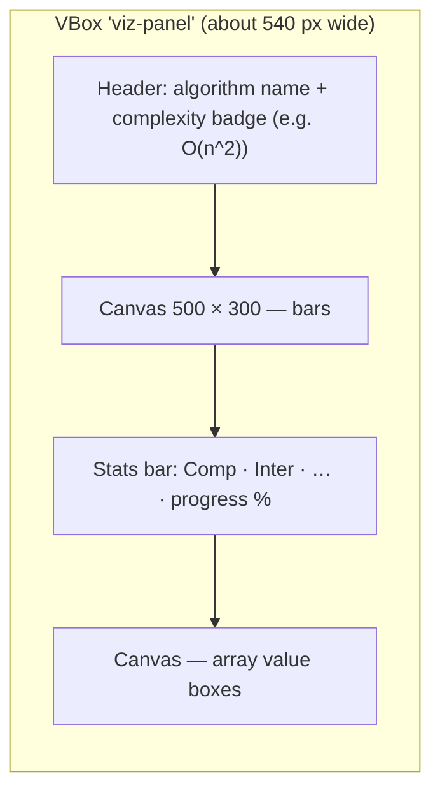
```mermaid
flowchart TB
    subgraph PANEL["VBox 'viz-panel' (about 540 px wide)"]
        direction TB
        H["Header: algorithm name + complexity badge (e.g. O(n^2))"]
        C1["Canvas 500 × 300 — bars"]
        S["Stats bar: Comp · Inter · … · progress %"]
        C2["Canvas — array value boxes"]
        H --> C1 --> S --> C2
    end
```

`drawFrame(array, activeIdx, comparisons, interchanges, progress)`:

1. Clears the canvas with the background (`#13141a`).
2. Computes `min`, `max`, bar width `500 / n` and a gap that shrinks for narrow bars.
3. Draws each bar with height `(value + shift) / range × 300` — **teal** `#00d4aa` when `progress == 100`, **red** `#ff5c6a` for the active index, **slate** `#2e3148` otherwise.
4. Plays a tone for the active element (unless finished).
5. Redraws the row of value boxes (font size adapts to cell width; numbers are hidden when cells are too narrow) and updates the three labels.

### `SortAnimator` — the player

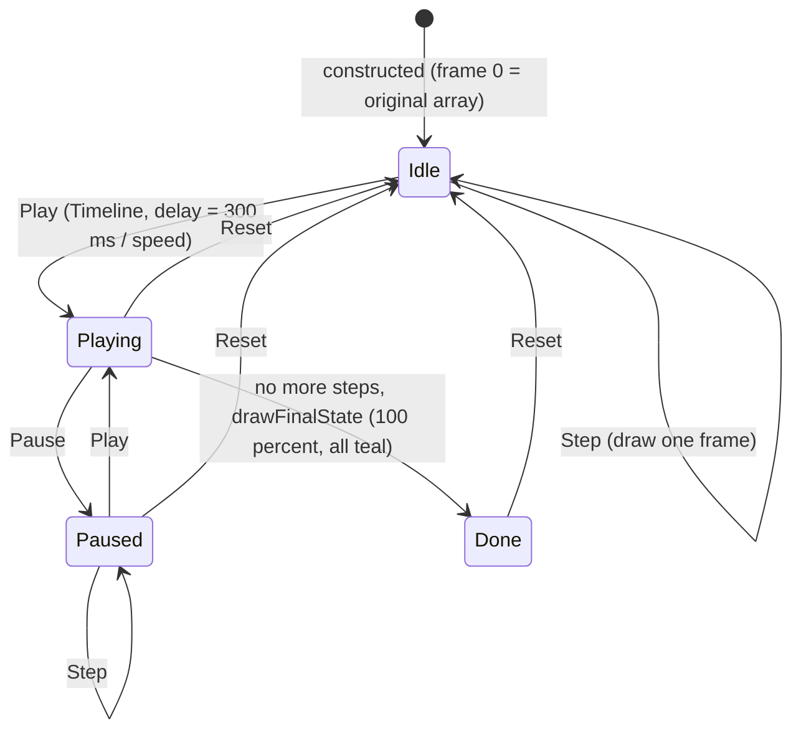
```mermaid
stateDiagram-v2
    [*] --> Idle : constructed (frame 0 = original array)
    Idle --> Playing : Play (Timeline, delay = 300 ms / speed)
    Playing --> Paused : Pause
    Paused --> Playing : Play
    Playing --> Done : no more steps, drawFinalState (100 percent, all teal)
    Idle --> Idle : Step (draw one frame)
    Paused --> Paused : Step
    Playing --> Idle : Reset
    Paused --> Idle : Reset
    Done --> Idle : Reset
```

* A `Timeline` with a **single `KeyFrame`** and `INDEFINITE` cycle count fires every `300 / speed` ms and draws `sortSteps[currentStep++]`.
* When steps run out, it stops and calls `drawFinalState()` using the last snapshot (no active bar, 100 %).
* The speed is read **when Play is pressed**, so a slider change takes effect on the next Play.

### `Audio` — sonification

* One **persistent** `SourceDataLine` (44.1 kHz, 16-bit, mono, little-endian), opened lazily and guarded by a lock.
* `playTone(value, maxValue)` → frequency `150 + (value/max) × 1050` Hz, a 50 ms buffer with a **10 % attack / 20 % release envelope** (to avoid clicks) at 30 % volume.
* Any audio failure (no sound device, etc.) is swallowed — the app simply stays silent.

### Theme

`style.css` defines a "Carbon Dark" look (`#13141a` background, JetBrains Mono → Consolas → Courier New font stack) with button variants (`btn-primary`, `btn-accent`, `btn-ghost`, `btn-warning`, `btn-danger`), pill-shaped algorithm chips, styled tabs, tables, sliders, scroll bars and visualization panel classes. The Python dashboard reuses the same palette so charts match the app.

---

## 💾 Data Model, Input & CSV Format

### Input file format

A **single line** in Python-list style, with `", "` (comma + space) separators:

```text
[1, 4, 5, 2, 8, 9, 10, 12, 7, 0, 35]
```

* Visualization Mode: **2–100** elements.
* Comparison Mode: any size; multiple files allowed.
* Brackets are stripped, then the line is split on exactly `", "` — so `1,2,3` (no spaces) will fail to parse.

### CSV format

```text
Algorithm,ArraySize,ArrayType,NoOfRuns,AvgRuntimeNs,MinRuntimeNs,MaxRuntimeNs,Comparisons,Interchanges
MergeSort,400,RANDOM,200,583378,284707,11536066,2960,3488
QuickSort,400,RANDOM,200,2078641,1353684,13918646,3831,1991
```

For file-based tasks the **`ArrayType` column contains the file path** instead of `RANDOM`/`SORTED`/….

### Data flow

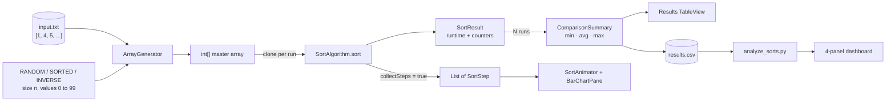
```mermaid
flowchart LR
    F[("input.txt<br/>[1, 4, 5, ...]")] --> GEN["ArrayGenerator"]
    R["RANDOM / SORTED / INVERSE<br/>size n, values 0 to 99"] --> GEN
    GEN --> ARR["int[] master array"]
    ARR -->|"clone per run"| ALG["SortAlgorithm.sort"]
    ALG --> SR["SortResult<br/>runtime + counters"]
    SR -->|"N runs"| SUMM["ComparisonSummary<br/>min · avg · max"]
    SUMM --> TBL["Results TableView"]
    SUMM --> CSV[("results.csv")]
    CSV --> PY["analyze_sorts.py"]
    PY --> DASH["4-panel dashboard"]
    ALG -->|"collectSteps = true"| STEPS["List of SortStep"]
    STEPS --> ANIM["SortAnimator + BarChartPane"]
```

---

## 🔄 Key Flows (Sequence Diagrams)

### 1. Sequential benchmark

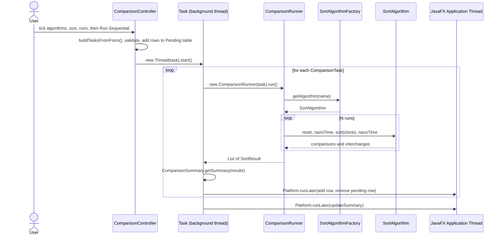
```mermaid
sequenceDiagram
    actor U as User
    participant C as ComparisonController
    participant T as Task (background thread)
    participant R as ComparisonRunner
    participant F as SortAlgorithmFactory
    participant A as SortAlgorithm
    participant FX as JavaFX Application Thread
    U->>C: tick algorithms, size, runs, then Run Sequential
    C->>C: buildTasksFromForm(), validate, add rows to Pending table
    C->>T: new Thread(task).start()
    loop for each ComparisonTask
        T->>R: new ComparisonRunner(task).run()
        R->>F: getAlgorithm(name)
        F-->>R: SortAlgorithm
        loop N runs
            R->>A: reset, nanoTime, sort(clone), nanoTime
            A-->>R: comparisons and interchanges
        end
        R-->>T: List of SortResult
        T->>T: ComparisonSummary.getSummary(results)
        T->>FX: Platform.runLater(add row, remove pending row)
    end
    T->>FX: Platform.runLater(updateSummary)
```

### 2. Parallel benchmark

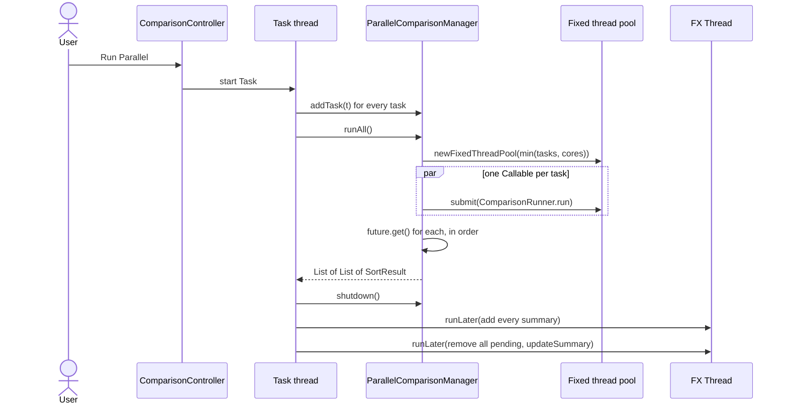
```mermaid
sequenceDiagram
    actor U as User
    participant C as ComparisonController
    participant T as Task thread
    participant M as ParallelComparisonManager
    participant P as Fixed thread pool
    participant FX as FX Thread
    U->>C: Run Parallel
    C->>T: start Task
    T->>M: addTask(t) for every task
    T->>M: runAll()
    M->>P: newFixedThreadPool(min(tasks, cores))
    par one Callable per task
        M->>P: submit(ComparisonRunner.run)
    end
    M->>M: future.get() for each, in order
    M-->>T: List of List of SortResult
    T->>M: shutdown()
    T->>FX: runLater(add every summary)
    T->>FX: runLater(remove all pending, updateSummary)
```

### 3. Add a visualizer and play it

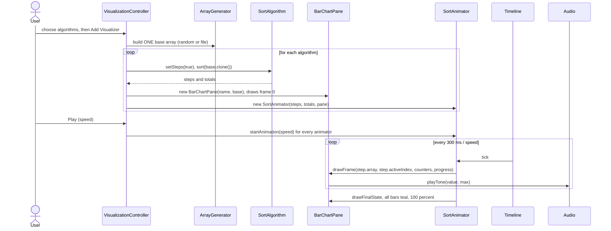
```mermaid
sequenceDiagram
    actor U as User
    participant VC as VisualizationController
    participant G as ArrayGenerator
    participant A as SortAlgorithm
    participant BP as BarChartPane
    participant SA as SortAnimator
    participant TL as Timeline
    participant AU as Audio
    U->>VC: choose algorithms, then Add Visualizer
    VC->>G: build ONE base array (random or file)
    loop for each algorithm
        VC->>A: setSteps(true), sort(base.clone())
        A-->>VC: steps and totals
        VC->>BP: new BarChartPane(name, base), draws frame 0
        VC->>SA: new SortAnimator(steps, totals, pane)
    end
    U->>VC: Play (speed)
    VC->>SA: startAnimation(speed) for every animator
    loop every 300 ms / speed
        TL->>SA: tick
        SA->>BP: drawFrame(step.array, step.activeIndex, counters, progress)
        BP->>AU: playTone(value, max)
    end
    SA->>BP: drawFinalState, all bars teal, 100 percent
```

### 4. CSV export and analysis

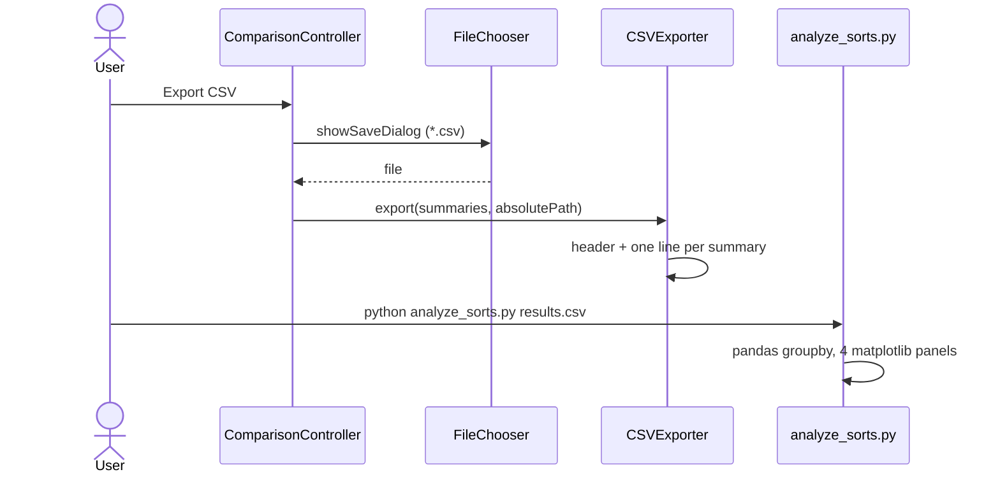
```mermaid
sequenceDiagram
    actor U as User
    participant C as ComparisonController
    participant FC as FileChooser
    participant X as CSVExporter
    participant PY as analyze_sorts.py
    U->>C: Export CSV
    C->>FC: showSaveDialog (*.csv)
    FC-->>C: file
    C->>X: export(summaries, absolutePath)
    X->>X: header + one line per summary
    U->>PY: python analyze_sorts.py results.csv
    PY->>PY: pandas groupby, 4 matplotlib panels
```

---

## 🧵 Concurrency Design

| Concern | How it's handled |
|---|---|
| **Keep the UI responsive** | Both run buttons wrap the work in a `javafx.concurrent.Task` started on a **new thread** |
| **Touching UI state** | Only through `Platform.runLater(...)` (adding result rows, removing pending tasks, updating labels) |
| **Parallel execution** | `Executors.newFixedThreadPool(min(tasks, availableProcessors))`; one `Callable<List<SortResult>>` per task; `Future.get()` joins them |
| **Thread safety of algorithms** | No sharing: each `ComparisonRunner` obtains **its own** `SortAlgorithm` instance from the factory, so mutable counters/steps are thread-confined |
| **Shared audio line** | `Audio` serialises access with a `synchronized` block on a private lock |
| **Animation** | JavaFX `Timeline` runs on the FX thread — no manual threading needed |

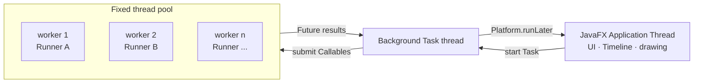
```mermaid
flowchart LR
    FXT["JavaFX Application Thread<br/>UI · Timeline · drawing"]
    BG["Background Task thread"]
    subgraph POOL["Fixed thread pool"]
        W1["worker 1<br/>Runner A"]
        W2["worker 2<br/>Runner B"]
        W3["worker n<br/>Runner ..."]
    end
    FXT -- "start Task" --> BG
    BG -- "submit Callables" --> POOL
    POOL -- "Future results" --> BG
    BG -- "Platform.runLater" --> FXT
```

> ⚖️ **Benchmark fairness:** parallel tasks compete for CPU cores, caches and the JIT compiler, so timings from **Run Parallel** are noisier than **Run Sequential**. Use parallel for speed, sequential for cleaner numbers.

---

## 🐍 Python Analysis Script

`analyze_sorts.py` (95 lines) turns an exported CSV into one figure with four panels, in the same dark palette as the app:

| Panel | What it plots | Data used |
|---|---|---|
| **1 — Average Runtime (log)** | One bar per algorithm | Largest `ArraySize` in the file |
| **2 — Min / Avg / Max Runtime (log)** | Three grouped bars per algorithm | Largest `ArraySize` |
| **3 — Comparisons vs Interchanges** | Two grouped bars per algorithm (linear scale) | Largest `ArraySize` |
| **4 — Runtime vs Array Size (log)** | One line per algorithm across sizes | `RANDOM` rows only; shows a "need multiple sizes" message if the CSV has one size |

Each algorithm has a fixed color (`BubbleSort #ff5c6a`, `InsertionSort #ffb347`, `SelectionSort #f7c948`, `MergeSort #4f8ef7`, `QuickSort #00d4aa`, `HeapSort #b48ef7`).

```bash
pip install pandas matplotlib numpy
cd SortingAlgorithms
python analyze_sorts.py data/output/results.csv     # path is optional
```

> ⚠️ The script's **default** path is `results.csv` in the *current directory* (not `data/output/results.csv`), so pass the path explicitly as shown above.

---

## 📈 Sample Results & What They Show

From the bundled `data/output/results.csv` (`RANDOM` arrays, values 0–99):

**n = 400, 200 runs per algorithm**

| Algorithm | Avg runtime (ns) | Min (ns) | Max (ns) | Comparisons | Interchanges |
|---|---:|---:|---:|---:|---:|
| MergeSort | 583,378 | 284,707 | 11,536,066 | 2,960 | 3,488 |
| QuickSort | 2,078,641 | 1,353,684 | 13,918,646 | 3,831 | 1,991 |
| HeapSort | 2,146,044 | 1,414,536 | 13,953,056 | 5,698 | 3,100 |
| InsertionSort | 18,212,252 | 14,998,566 | 45,766,251 | 40,014 | 40,010 |
| SelectionSort | 18,251,822 | 14,258,478 | 46,555,382 | 79,800 | 390 |
| BubbleSort | 22,427,551 | 11,658,736 | 69,209,992 | 79,800 | 39,587 |

**Scaling when the array grows 4× (n = 100 → 400)**

| Algorithm | Avg runtime n=100 (ns) | Avg runtime n=400 (ns) | Growth |
|---|---:|---:|---:|
| MergeSort | 61,513 | 583,378 | ×9.5 |
| QuickSort | 332,790 | 2,078,641 | ×6.2 |
| HeapSort | 233,510 | 2,146,044 | ×9.2 |
| InsertionSort | 560,313 | 18,212,252 | ×32.5 |
| SelectionSort | 528,305 | 18,251,822 | ×34.5 |
| BubbleSort | 750,467 | 22,427,551 | ×29.9 |

**Reading the numbers**

* 🟦 The three **O(n log n)** algorithms are roughly **8–40× faster** than the three **O(n²)** ones at n = 400 (Merge ≈ 38× faster than Bubble).
* 🧮 `BubbleSort` and `SelectionSort` both show exactly **79,800 = 400·399/2** comparisons — direct confirmation that neither stops early.
* 🔁 `SelectionSort` makes the fewest interchanges (**390**); `InsertionSort` the most (~40,000 — it moves one element at a time).
* 📉 Growth factors for the quadratic sorts (~30×) exceed the ideal 16× for a 4× size increase, and the **max-vs-min spread** (often 10–40×) points to **JIT warm-up and OS noise** in early runs — these are single-JVM wall-clock timings with no warm-up phase.
* 🎯 `MergeSort` beats `QuickSort` here even though QuickSort does fewer writes — at n ≤ 400 constant factors (recursion, a new `Random` per partition) matter more than asymptotics.

---

## 🧩 Design Patterns

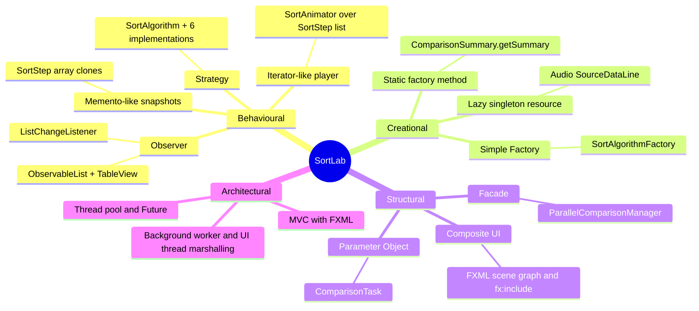
```mermaid
mindmap
  root((SortLab))
    Behavioural
      Strategy
        SortAlgorithm + 6 implementations
      Observer
        ObservableList + TableView
        ListChangeListener
      Iterator-like player
        SortAnimator over SortStep list
      Memento-like snapshots
        SortStep array clones
    Creational
      Simple Factory
        SortAlgorithmFactory
      Static factory method
        ComparisonSummary.getSummary
      Lazy singleton resource
        Audio SourceDataLine
    Structural
      Facade
        ParallelComparisonManager
      Parameter Object
        ComparisonTask
      Composite UI
        FXML scene graph and fx:include
    Architectural
      MVC with FXML
      Thread pool and Future
      Background worker and UI thread marshalling
```

| # | Pattern | Where | Why it is used |
|---|---|---|---|
| 1 | **Strategy** | `SortAlgorithm` interface + `BubbleSort … HeapSort` | `ComparisonRunner`, `VisualizationController` and `SortAnimator` work against the interface only; the algorithm is chosen at runtime by name |
| 2 | **Simple (static) Factory** | `SortAlgorithmFactory.getAlgorithm(String)` (private constructor, switch expression) | One place maps `"MergeSort"` → `new MergeSort()`; callers never use `new` on a concrete sort |
| 3 | **Abstract base class (shared behaviour)** | `AbstractSort` | Counters, step recording, `swap`, `reset` are written once, not six times |
| 4 | **Observer** | JavaFX `ObservableList`s bound to `TableView`s; `ListChangeListener` for the row-count badge | Tables update automatically when the lists change |
| 5 | **MVC (with FXML)** | FXML = View, `*Controller` = Controller, `model/` classes = Model | Layout is declarative; logic stays in Java; styling in CSS |
| 6 | **Memento-like snapshots / record-and-replay** | `SortStep` stores a *clone* of the array per frame | Algorithms run once and are replayed later, decoupling computation from animation |
| 7 | **Iterator-style cursor** | `SortAnimator.currentStep` over `List<SortStep>` | Play, pause, step and reset are just moves of a cursor |
| 8 | **Facade** | `ParallelComparisonManager` | Hides executor creation, submission, `Future` joining and shutdown behind `addTask / runAll / shutdown` |
| 9 | **Parameter / Value Object** | `ComparisonTask` (immutable), `SortResult`, `SortStep` | Bundles related data passed between layers |
| 10 | **Static factory / aggregator** | `ComparisonSummary.getSummary(List<SortResult>)` | Builds a fully-populated summary from raw runs |
| 11 | **Thread pool + Future** | `Executors.newFixedThreadPool`, `Future.get()` | Parallel benchmarking with bounded concurrency |
| 12 | **Background worker + UI-thread marshalling** | `javafx.concurrent.Task` + `Platform.runLater` | Long work off the FX thread; UI mutations back on it |
| 13 | **Lazy singleton resource** | `Audio.audioLine` (static, opened on first use, lock-guarded) | One audio device line reused for every tone |
| 14 | **Utility (non-instantiable) classes** | `SortAlgorithmFactory`, `CSVExporter` (private constructors), `ArrayGenerator` (static methods) | Stateless helpers |
| 15 | **Composite (UI)** | FXML scene graph; `fx:include` of two sub-layouts into `Main.fxml` | Layouts composed from smaller reusable pieces |
| 16 | **Layered architecture** | UI → orchestration → algorithms → model | Each layer depends only downward |

---

## 🏛️ OOP Principles & SOLID

### The four pillars

| Pillar | Evidence in the code |
|---|---|
| **Encapsulation** | Model classes use private fields + getters/setters (`ComparisonTask` is fully immutable with `final` fields); `ComparisonController` keeps all FXML nodes and helpers `private`; `Audio` hides the `SourceDataLine` and lock; `SortAnimator`'s cursor and timeline are private; counters in `AbstractSort` are `protected`, exposed through getters |
| **Abstraction** | `SortAlgorithm` describes *what* a sorter offers (sort, counters, steps) without saying *how*; `ParallelComparisonManager` abstracts away thread-pool plumbing |
| **Inheritance** | Six concrete sorts extend `AbstractSort`, which implements `SortAlgorithm`; `Main extends Application` |
| **Polymorphism** | `algorithm.sort(array)` dispatches to the right algorithm at runtime; the factory returns the interface type; the same `BarChartPane` / `SortAnimator` render any algorithm's steps |

### SOLID

| Principle | How it shows up | Honest caveat |
|---|---|---|
| **S** — Single Responsibility | Runner runs, summary aggregates, exporter writes CSV, generator generates arrays, animator plays, pane draws, audio plays | The two controllers handle validation, task building, threading *and* UI updates; `ComparisonController` is the largest class |
| **O** — Open/Closed | New algorithm = new class extending `AbstractSort` + one factory line; no change to runner/animator/pane | In practice more places need touching: the checkbox in two FXML files, the `getSelectedAlgorithms()` lists in both controllers, `complexity_map` in `BarChartPane`, and the color map in the Python script |
| **L** — Liskov Substitution | Any `SortAlgorithm` can replace another anywhere — all honour the same contract | — |
| **I** — Interface Segregation | Interface is compact (7 methods) | It mixes three concerns — sorting, statistics and step recording — which could be split |
| **D** — Dependency Inversion | High-level code (`ComparisonRunner`, animator) depends on the `SortAlgorithm` abstraction | Concrete algorithms come from a *static* factory and controllers `new` their collaborators directly, so substituting them in tests would need refactoring |

### Other principles in play

* **Separation of concerns** — UI (FXML/CSS/controllers) ⟂ benchmarking ⟂ algorithms ⟂ visualization.
* **Fair experiments** — identical `base.clone()` for every algorithm in Visualization Mode; a clone per run in Comparison Mode.
* **Pay only for what you use** — step recording is **off** during benchmarks.
* **Thread confinement** — one algorithm instance per task; UI changes only on the FX thread.
* **Defensive copying** — `SortStep` clones its array; algorithms receive `original.clone()`.
* **Graceful degradation** — audio failures are swallowed; the visualization continues silently.
* **Fail-safe UX** — user mistakes (no algorithm selected, non-numeric size, oversize array) produce warning dialogs rather than exceptions.

---

## 📐 Data Structures & Algorithms Used

| Structure / technique | Where | Purpose |
|---|---|---|
| `int[]` | Everywhere | The data being sorted; cloned per run/frame |
| Implicit **binary max-heap in an array** | `HeapSort` | Parent `i`, children `2i+1`, `2i+2`; `heapSize` shrinks as the sorted tail grows |
| **Recursion** (divide & conquer) | `MergeSort`, `QuickSort`, `HeapSort.max_heapify` | Subproblem decomposition |
| **Randomized pivot** (`Random.nextInt(p, r+1)`) | `QuickSort` | Makes worst-case inputs unlikely |
| Two-way **partition** | `QuickSort.partition` | In-place split around a pivot |
| **Merge of two sorted arrays** | `MergeSort.merge` | Linear-time combine with two cursors |
| `ArrayList<SortStep>` | `AbstractSort.steps` | Ordered list of animation frames (replay by index) |
| `ArrayList<SortResult>` / `List<List<SortResult>>` | Runner / parallel manager | Per-run measurements per task |
| `ArrayList<Future<…>>` | `ParallelComparisonManager` | Join handles for parallel tasks |
| `ObservableList` | Controllers | Observable collections feeding the `TableView`s |
| `Map.of(...)` (immutable map) | `BarChartPane.complexity_map` | Name → complexity badge text |
| **Min/max scan + linear scaling** | `BarChartPane.drawFrame` | Bar height = `(v + shift) / range × canvasHeight` |
| **Frequency mapping** | `Audio.playTone` | `f = 150 + (v / max) × 1050` Hz; sine wave with attack/release envelope |
| **Linear interpolation** | `SortAnimator.drawCurrentStep` | Counters shown = `total × currentStep / totalSteps` |
| Reflection-based cell factories | `PropertyValueFactory` | Binds table columns to getter names |
| `System.nanoTime()` | `ComparisonRunner` | Monotonic high-resolution timing |

**Complexity cheat-sheet**

| | Best | Average | Worst | Space |
|---|---|---|---|---|
| Bubble (no early exit) | O(n²) | O(n²) | O(n²) | O(1) |
| Insertion | O(n) | O(n²) | O(n²) | O(1) |
| Selection | O(n²) | O(n²) | O(n²) | O(1) |
| Merge | O(n log n) | O(n log n) | O(n log n) | O(n) |
| Quick (random pivot) | O(n log n) | O(n log n) | O(n²) | O(log n) |
| Heap | O(n log n) | O(n log n) | O(n log n) | O(1) |

---

## 🚀 Getting Started

### Prerequisites

* **JDK 21+**
* **Maven 3.8+**
* *(Optional, for the dashboard)* **Python 3.9+** with `pandas`, `matplotlib`, `numpy`
* *(Optional, for the report)* a LaTeX distribution with `tikz`, `pgfplots`, `listings`, `tcolorbox`
* A working **audio device** if you want sound (otherwise the app is silent but fully functional)

### 1 · Run the app

```bash
cd SortingAlgorithms
mvn javafx:run
```

The window opens maximized with two tabs.

> The `pom.xml` has no packaging/shade plugin, so use `mvn javafx:run` (or run `sorting.Main` from your IDE with JavaFX available) rather than `java -jar`.

### 2 · Try Comparison Mode

1. Leave **ARRAY TYPE = RANDOM**, set **SIZE = 400**, **RUNS = 50**.
2. Tick a few algorithms (e.g. Bubble, Merge, Quick).
3. Click **▶ Run Sequential** (or **⚡ Run Parallel**) — watch the **Pending Tasks** table drain and the **Results** table fill.
4. Switch the array type to **SORTED** or **INVERSELY_SORTED** and run again to see how input shape changes comparisons and interchanges.
5. **⬇ Export CSV**, then run the dashboard (below).

### 3 · Try Visualization Mode

1. Open the **Visualization Mode** tab; set **SIZE = 20** (max 100).
2. Tick 3–4 algorithms and click **+ Add Visualizer**.
3. Press **▶ Play** (try 2×), use **⏸ Pause**, **⏭ Step**, **↺ Reset**.
4. Turn your volume up: the pitch rises with the value under the red bar.

### 4 · Analyze the CSV

```bash
pip install pandas matplotlib numpy
python analyze_sorts.py data/output/results.csv
```

### 5 · Build the report (optional)

```bash
cd SortingAlgorithms/latex
pdflatex report.tex && pdflatex report.tex     # twice for the table of contents
```

---

## ⚙️ Configuration

| Setting | Value | Location |
|---|---|---|
| Java / JavaFX version | 21 / 21 | `pom.xml` (`maven.compiler.*`, `javafx.version`) |
| Main class | `sorting.Main` | `javafx-maven-plugin` config in `pom.xml` |
| Window | Maximized, title "SortLab — Algorithm Analyzer" | `Main.java` |
| Random value range | `0 – 99` | `ArrayGenerator.generateFromRandom` |
| Max array size (visualization) | `100` | `VisualizationController.buildBaseArray` |
| Thread-pool size | `min(#tasks, availableProcessors)` | `ParallelComparisonManager.runAll` |
| Animation delay | `300 ms ÷ speed` (speed 0.5 – 4) | `SortAnimator.startAnimation`, slider in `Visualization.fxml` |
| Canvas size per panel | `500 × 300` px (value boxes: 40 px high) | `BarChartPane` constants |
| Tone | 44.1 kHz · 16-bit · mono · 50 ms · 150 – 1200 Hz | `Audio` |
| Bar colors | idle `#2e3148` · active `#ff5c6a` · done `#00d4aa` · bg `#13141a` | `BarChartPane` |
| CSV output folder created | `data/output` (relative to the working dir) | `CSVExporter` |
| Python default input | `results.csv` (current dir) | `analyze_sorts.py` |

---

## 🧪 Testing

| Tier | Status |
|---|---|
| Java unit tests | **None** — there is no `src/test` folder and no JUnit dependency in `pom.xml` |
| Manual | GUI flows, plus the screenshots/charts captured in `latex/Images/` |

Good first targets, because they are plain classes with no JavaFX dependency:

* Every `SortAlgorithm` returns a **sorted array** for random, sorted, inverse, duplicate-heavy, empty and one-element inputs.
* `Bubble`/`Selection` comparison counts equal `n(n−1)/2`.
* `ArrayGenerator.generateFromRandom(SORTED / INVERSELY_SORTED)` really returns ascending / descending arrays.
* `ComparisonSummary.getSummary` on a hand-made list of `SortResult`s.
* `SortAnimator.step()` advances exactly one frame.

---

## 🧭 Known Limitations & Roadmap

Observations from reading the code, roughly by impact. None block normal use.

### Visualization correctness

| # | Finding | Suggested fix |
|---|---|---|
| 1 | **Progress label stays at `0%` until the end.** `SortAnimator` computes `currentStep / sortSteps.size() * 100` with *integer* division, so it is 0 for every frame except the last, which is drawn separately at 100 %. In **Step** mode the final frame never turns teal. | Use `(int) (100.0 * currentStep / size)` and draw the final state when stepping past the end. |
| 2 | **Counters are interpolated, not exact.** Displayed comparisons/interchanges are `total × currentStep / totalSteps`, a linear estimate rather than the real count at that step. | Store the counters in each `SortStep`. |
| 3 | **MergeSort frames show sub-arrays.** Merge writes into the temporary `left`/`right` arrays it creates, and `addStep` clones *that* array, so early frames show the small arrays being merged (bar widths change) rather than the whole array; only the last merge shows all *n* bars. | Pass the full array and an offset into `merge`, or sort in place on a shared buffer. |
| 4 | **Speed only applies at Play time** (slider value is read once). | Bind the slider to the timeline rate. |
| 5 | **Audio runs on the FX thread.** `playTone` writes a 50 ms buffer synchronously for every frame of every panel; with several panels at high speed this can stall the UI. `closeAudio()` is never called. | Play tones on a dedicated audio thread/queue; close the line on exit. |

### Benchmark methodology

| # | Finding | Suggested fix |
|---|---|---|
| 6 | No **JIT warm-up**, and the timed region includes `original.clone()`, so early runs inflate the max (see the 10–40× min/max spreads). | Add warm-up runs; clone outside the timed section; report the median. |
| 7 | **Parallel mode distorts timings** (tasks share cores/caches). Results also appear only after *all* tasks finish, whereas sequential mode adds rows as they complete. | Show a "use sequential for timing" hint; stream results with `ExecutorCompletionService`. |
| 8 | **Bubble Sort has no early exit**, so it never benefits from sorted input (always `n(n−1)/2` comparisons). | Add a `swapped` flag if an adaptive variant is wanted. |
| 9 | **Quick Sort + many duplicates.** Values come from `0–99`, and the `<=` partition sends all equal keys to one side, so large arrays full of ties degrade toward O(n²) with deeper recursion. | Three-way (Dutch-flag) partition; hoist `Random` to a field. |
| 10 | The summary-bar **AVG / MIN / MAX mixes all rows** (different sizes and types), so it is only meaningful when every row shares one configuration. | Compute per size/type, or label it "across all rows". |
| 11 | Counter semantics differ between algorithms (see [the table](#what-comparisons-and-interchanges-mean-here)). | Document or standardise (e.g. count writes uniformly). |

### Robustness

| # | Finding | Suggested fix |
|---|---|---|
| 12 | **Brittle file parsing.** Needs `", "` separators on one line; `generateFromFile` returns `null` on I/O errors, and the runner then hits a `NullPointerException` inside the background task (pending rows are never cleared, no message shown). An empty file also NPEs. | Handle errors and show an `Alert`; accept any whitespace/comma format and multiple lines. |
| 13 | `SortAlgorithmFactory` returns `null` for unknown names, and `ParallelComparisonManager` only `println`s `ExecutionException`s (that task's results silently go missing). | Throw `IllegalArgumentException`; propagate errors to the UI. |
| 14 | `CSVExporter` always creates `data/output/` (even if you save elsewhere) and reports success/failure only on stdout. | Create the chosen file's parent; show a dialog. |
| 15 | Validation text says "greater than 1" but `1` is accepted. | Fix the message. |
| 16 | `VisualizationController` casts to `AbstractSort` to call `setSteps(true)` although `setSteps` is already on the `SortAlgorithm` interface. | Remove the cast. |

### Project hygiene

| # | Finding | Suggested fix |
|---|---|---|
| 17 | `venv/pyvenv.cfg` (contains a local absolute path), `texput.log` and nested `.idea/` folders are committed. | Add to `.gitignore`. |
| 18 | The original `README` says MIT, but no `LICENSE` file is included. | Add one. |
| 19 | Debug `System.out.println` calls in `Main`, algorithm and I/O classes; a commented-out `main` in `ArrayGenerator`. | Use a logger; delete dead code. |
| 20 | **No automated tests.** | See [Testing](#-testing). |

### Roadmap ideas

* ➕ More algorithms — Shell, Counting, Radix, 3-way Quick, Tim — each is *one class + one factory line* thanks to the Strategy design
* 📏 Other input distributions (nearly sorted, few unique values, Gaussian) and a configurable value range
* 📊 Embedded charts in the app (JavaFX `LineChart`) instead of a separate Python step
* 🧠 Per-step counters and a "stable / in-place / adaptive" badge per panel
* 🔇 Mute toggle, configurable timbre, stereo panning by array position
* 🧪 JUnit 5 + a JMH micro-benchmark module for rigorous timings
* 📦 `jlink` / `jpackage` to ship a native installer

---

<div align="center">

**SortLab** — one algorithm core, two ways to look at it: measure it, then watch it.

</div>
